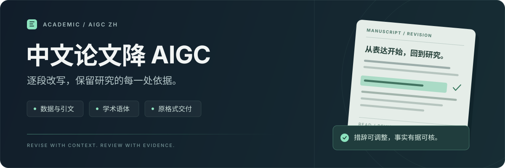

<p align="center">
  <picture>
    <source media="(max-width: 640px)" srcset="./assets/readme-hero-mobile.svg" />
    
  </picture>
</p>

<p align="center">
  <strong>期刊论文 · 学位论文 · 研究报告</strong>
</p>

<p align="center">
  <a href="#开始使用">开始使用</a> &nbsp; · &nbsp;
  <a href="#功能模块">功能模块</a> &nbsp; · &nbsp;
  <a href="#交付方式">交付方式</a>
</p>

---

**academic-aigc-zh** 是面向中文论文的 AIGC 改写技能。围绕原文逐段调整表达，核对数据、术语、引文与论证关系，并将修改整理为可审阅的交付文件。

<table>
  <tr>
    <td width="33%" valign="top">
      <sub>01</sub><br /><br />
      <strong>表达自然</strong><br />
      按段落调整句法，处理套话与冗余。
    </td>
    <td width="33%" valign="top">
      <sub>02</sub><br /><br />
      <strong>信息可核</strong><br />
      保留数据、引文及其对应关系。
    </td>
    <td width="33%" valign="top">
      <sub>03</sub><br /><br />
      <strong>修改可见</strong><br />
      通过批注和对比查看具体修改。
    </td>
  </tr>
</table>

## 开始使用

### 1. 获取技能

```bash
git clone https://github.com/SoMic520/academic-aigc-zh.git
```

在支持 `SKILL.md` 的助手中导入整个 `academic-aigc-zh` 目录，以根目录的 [SKILL.md](./SKILL.md) 为入口，保留包内文件结构。

### 2. 提供材料

附上论文正文，并说明需要保留的格式、篇幅要求和交付形式。已有 AIGC 检测报告时，可一并提供以定位标记段落。

### 3. 开始改写

可直接使用下面这段指令：

```text
请用 academic-aigc-zh 处理这篇中文论文，降低 AIGC 检测比例。
逐段调整表达，保留原有格式、数据、术语、引文和论证关系，不新增事实。
交付修订批注稿、净稿与逐段对比报告。
如果附有检测报告，请将标记对应到原文后处理。
```

**处理顺序：** 读取材料 → 固定事实与关系 → 逐段改写 → 保真复核 → 审阅交付。

## 功能模块

五个模块覆盖从原文定位到最终复核的主要环节。

| 模块 | 处理重点 | 规则入口 |
| :--- | :--- | :--- |
| **01 · 学术表达** | 固定事实、专业术语和限定条件，调整正式书面表达。 | [受保护片段](./references/local/academic-style/protected-spans.md) · [书面表达](./references/local/academic-style/positive-style-academic.md) |
| **02 · 段落改写** | 按段落承担的功能重组句法，控制篇幅与信息完整性。 | [逐段重组](./references/local/paragraph-rewrite/paragraph-rewrite.md) |
| **03 · 报告定位** | 将检测报告的标记对应到原文，处理重复文本和版本差异。 | [报告定位](./references/local/report-editing/report-editing.md) |
| **04 · 中文语体** | 检查套话、冗余、泛化评价和聊天式表达。 | [中文表达](./references/local/chinese-style/chinese-style.md) |
| **05 · 保真复核** | 核对新增与遗漏、结论强度、适用范围及引文关系。 | [反向审读](./references/local/fidelity-review/reverse-audit.md) |

<details>
<summary><strong>查看改写示例：保留比较对象与研究范围</strong></summary>

以下为项目内置的合成示例。

**原文**

> 本研究主要比较处理A与对照的土壤有机碳（SOC）含量。结果显示，处理A的SOC为18.6 g·kg⁻¹，对照为15.2 g·kg⁻¹，差异具有统计学意义（P＜0.05）。这一比较仅涉及本次采集的表层土壤。

**改写后**

> 本研究以本次采集的表层土壤为对象，比较处理A与对照的土壤有机碳（SOC）含量。处理A的SOC为18.6 g·kg⁻¹；对照的含量为15.2 g·kg⁻¹。两者含量的差异具有统计学意义（P＜0.05）。

**核对要点：** 调整了信息顺序，保留了比较对象、研究范围、数值、单位与统计限定。

[查看更多内置示例 →](./assets/rewrite-examples.json)

</details>

## 交付方式

按任务需要提供正文改写、文档修订或完整审阅交付。

| 交付文件 | 用途 |
| :--- | :--- |
| **Word 修订批注稿** | 在原文档中展示修改及批注，便于逐项审阅。 |
| **Word 净稿** | 保留原有格式，提供接受修改后的正文。 |
| **HTML 逐段对比报告** | 对照原文、改文和修改说明，方便离线查看。 |

文档编辑与渲染使用所用助手的文档处理能力。有检测报告时，效果核对以同一稿件、同一平台的实际复测为准。

[修订与交付说明 →](./references/review-delivery.md) &nbsp; · &nbsp; [检测报告与复测 →](./references/report-workflow.md)

## 项目资料

| 想了解什么 | 从这里开始 |
| :--- | :--- |
| 完整工作流程与执行规则 | [SKILL.md](./SKILL.md) |
| 中文论文的具体改写方法 | [改写规则](./references/rewrite-rules.md) |
| 模块、资源及版本记录 | [资源索引](./references/sources.md) |

<details>
<summary><strong>展开目录结构与辅助脚本</strong></summary>

```text
academic-aigc-zh/
├── SKILL.md                 技能入口
├── README.md                项目首页
├── agents/                  助手显示配置
├── assets/                  图标、词库与示例
├── references/              改写规则与资源记录
│   └── local/               五个功能模块
└── scripts/                 本地辅助脚本
```

辅助脚本使用 Python 3 标准库，无需额外安装 Python 依赖。

| 脚本 | 用途 |
| :--- | :--- |
| [scan_style.py](./scripts/scan_style.py) | 定位需要人工审阅的表达。 |
| [check_revision.py](./scripts/check_revision.py) | 核对篇幅与部分受保护内容。 |
| [compare_reports.py](./scripts/compare_reports.py) | 比较前后检测报告。 |
| [render_review_report.py](./scripts/render_review_report.py) | 生成离线 HTML 逐段对比报告。 |

</details>

---

<p align="center">
  <sub><strong>academic-aigc-zh</strong> &nbsp; · &nbsp; 中文学术写作工作流</sub>
</p>
